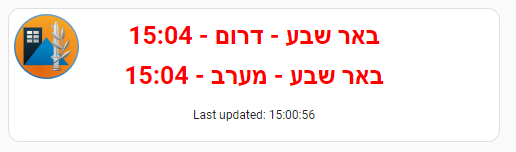
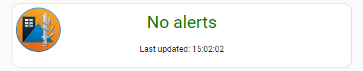

# Home assistant red alert notifications card
Real time and history alerts from פיקוד העורף

### demo



## installation

### 1. creating a history sensor
****thanks Amit Finkelstein for building this template query****

notes:<br>
change באר שבע to your city<br>
scan_interval is set to 2 seconds<br>
time frame is set to 600 (10 minutes)<br>

in `configuration.yaml` add:

```
sensor:
  - platform: rest
    name: Silent Red Alert
    resource: https://www.oref.org.il/WarningMessages/History/AlertsHistory.json
    scan_interval: 2
    value_template: >-
      
        
        
        
          
            {% set new_area = area.data + ' (' + as_datetime(area.alertDate).strftime('%H:%M') + ')' %}
            
              
            
              
            
          
        
        
        
          {{ (priority.list + areas.list) | join(' | ') | truncate(245) }}
        
          off
        
      
        off
      
    headers:
      Referer: https://www.oref.org.il/
      X-Requested-With: XMLHttpRequest
      Content-Type: "application/json"
```

### 2. installing the UI card
#### HACS manual Installation
- In the HACS Frontend, click the 3 dots in the upper right
- Click 'Add Custom Repository'
- Fill in the repo url https://github.com/silentbil/silent-red and choose 'Lovelace' category.
- Install the custom card (should now appear in the Frontend)
- HACS should automatically add the following to your resources:
```
url: /hacsfiles/silent-red/silent-red.js
type: Javascript Module
```

### 3. Now you can add the card to your dashboard:

#### show a specific city
```
type: custom:silent-red
city: באר שבע
sensor: sensor.silent_red_alert
refreshInterval: 3
```

#### show all cities with alerts (dont pass city parameter)
```
type: custom:silent-red
sensor: sensor.silent_red_alert
refreshInterval: 3
```
